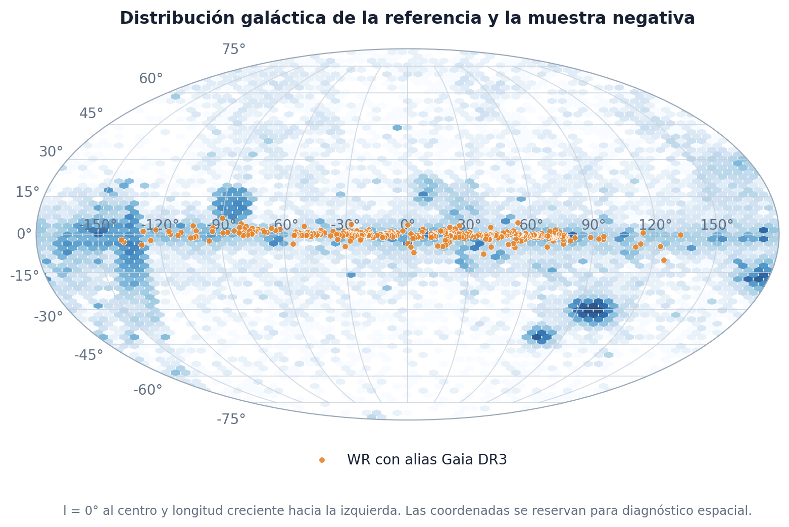
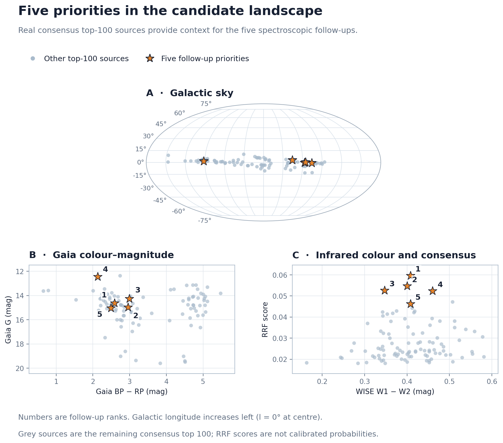
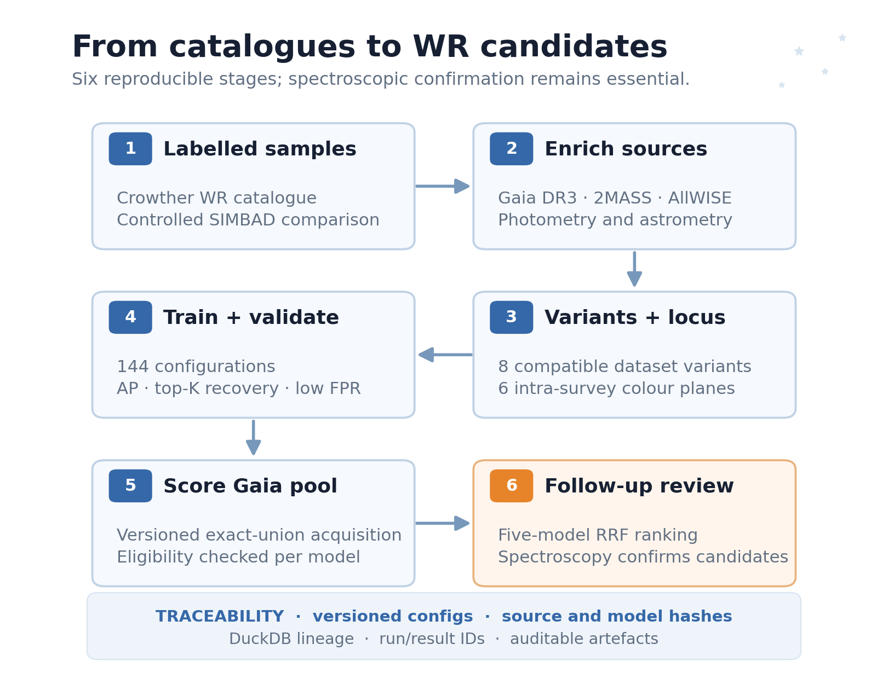
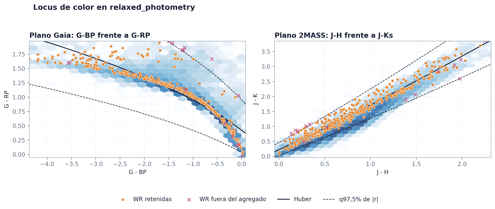
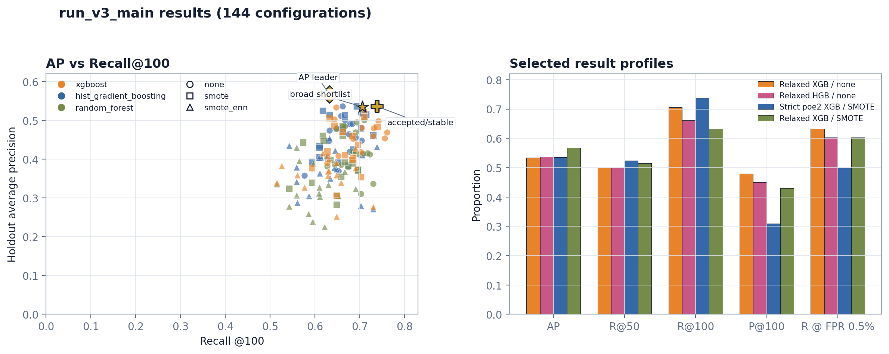

# Wolf-Rayet Search

Wolf-Rayet Search ranks Galactic Wolf-Rayet (WR) candidates from Gaia DR3, 2MASS and WISE photometry for spectroscopic follow-up.



*Known Wolf-Rayet stars concentrate near the Galactic plane; the negative sample spans a wider sky area. The map is a spatial diagnostic, not a probability map.*

## Scientific motivation

Catalogue construction, a physically constrained colour-locus, rare-object model selection and a Gaia-scale prediction pool are often treated separately. This project connects them into one reproducible workflow.

The output is a ranked candidate list for astronomical follow-up, not an automatic claim that a source is a new WR star.

## Research question

Can a reproducible, auditable pipeline recover known Galactic WR stars and prioritize previously unconfirmed Gaia sources that merit spectroscopic confirmation?

## Current research status

The reference, negative-sample, colour-locus and modelling pipelines are implemented. The first Gaia-scale prediction pool was also built, but an independent audit found that its local `aggregated_mean_fit` filter does not retain every source accepted by at least one model-compatible dataset variant:

- 44,469 Gaia sources were evaluated in 18 stratified sky regions;
- the aggregate rejected 1,960 of 26,369 sources accepted by at least one compatible variant: 7.43%;
- regional discrepancies reached 18.90%;
- two known WR regression controls were affected;
- seven variants showed misses in Gaia data, and constructive colour counterexamples refuted a superset guarantee for all eight variants.

The existing 58,037,788-row pool is therefore registered as a read-only legacy build. It remains useful for auditing and engineering checks, but it is not approved for definitive candidate scoring. The replacement exact-union build is complete and audited: 675/675 tiles, 185,135,016 acquired rows, 65,010,724 accepted by the compatible-variant union, 32,345 known exclusions and 64,978,379 operational sources. The frozen `run_v3_main` five-model application completed 3,375/3,375 scoring units. Its persisted RRF review contains the top-500 SIMBAD-enriched shortlist, the detailed top 20 and five follow-up priorities.

This research project began in 2024 and is being developed toward a scientific manuscript. The ranked candidate set has been shared with collaborating astronomers for archival-spectrum searches and spectral assessment. Until that review is complete, every listed source remains a candidate rather than a confirmed Wolf-Rayet star.



*Orange stars mark the five follow-up priorities from the persisted equal-weight RRF consensus; grey points are the other sources in its top 100. The score ranks sources; it is not a calibrated probability of being a WR star.*

## Methodology



*Each stage writes auditable data or model artefacts. Spectroscopy remains the confirmation step.*

The workflow has six phases:

1. **Known WR reference catalogue** — Galactic WR records with explicit Gaia DR3 aliases, enriched with Gaia, 2MASS and WISE photometry (VizieR fallback when Gaia crossmatch tables are incomplete).
2. **Controlled non-WR sample** — configured SIMBAD contaminant classes with known WR `source_id` values excluded.
3. **Colour locus** — robust Huber regressions on intra-survey colours only (Gaia `G_BP`/`G_RP`/`BP_RP`, 2MASS `J_H`/`J_K`/`H_K`); `W1_W2` remains a model feature, not a locus plane.
4. **Dataset variants and model training** — eight `strict`/`relaxed` × astrometric combinations, stable `source_id` hash split, colour-locus filtering before holdout, and a 144-configuration sweep.
5. **Model inspection and optional validation audit** — Streamlit Model Explorer for run comparison, case review and read-only candidate rankings; WN/WC one-class validators remain diagnostic.
6. **Gaia prediction pool** — acquisition-first exact-union build, variant-bit scoring, reciprocal-rank fusion review and stakeholder delivery.

```text
broad acquisition envelope
→ persist every acquired source before eligibility filtering
→ evaluate every compatible dataset variant locally
→ expose the combined eligible pool and model subsets as logical views
→ score each model only on sources carrying its variant bit
```

## Data



*Orange points are retained WR reference stars, pink crosses are WR outside the locus, and blue hexagons show the controlled negative sample. The fitted bands use colours measured within the same survey.*

| Component | Definition |
|---|---|
| `strict` | Required 2MASS and WISE bands have quality A |
| `relaxed` | Required 2MASS and WISE bands have quality A or B |
| `photometry` | No parallax restriction |
| `parallax_soft` | `parallax > 0` |
| `poe_2` | `parallax > 0` and `parallax_over_error >= 2` |
| `poe_3` | `parallax > 0` and `parallax_over_error >= 3` |

Large generated artefacts stay outside Git. The small, stable handoff material under `reports/public/` is the deliberate exception:

| Artefact | Local path |
|---|---|
| WR reference database | `data/databases/wr_reference.duckdb` |
| SIMBAD negative database | `data/databases/simbad_negative.duckdb` |
| Training history | `data/databases/training_history.duckdb` |
| Legacy prediction pool | `data/databases/prediction_pool.duckdb` |
| Prediction pool (build id `exact_union`) | `data/databases/prediction_pool_exact_union_v1.duckdb` |
| Prediction scoring registry | `data/databases/prediction_pool_scoring.duckdb` |
| Candidate review and SIMBAD snapshot index | `data/databases/prediction_pool_candidates.duckdb` |
| Candidate/model delivery | `outputs/wr_prediction_delivery_v1/` |
| Reduced modelling datasets | `data/processed/modeling/` |
| Model runs | `reports/modeling/runs/{run_id}/` |
| Prediction scores | `data/processed/prediction_pool_scores/{scoring_run_id}/` |
| Variant-compatibility audit | `reports/analysis/prediction_pool_locus_audit/` |
| Public figures and evidence snapshot | `reports/public/` |
| Optional reviewer bundle | `dist/wolf_rayet_search_review_bundle.zip` |

Run IDs, dataset hashes, configuration hashes and source-level predictions keep comparisons tied to the data that produced them.
Each candidate-review rebuild also retains a hash-named DuckDB snapshot under `reports/analysis/prediction_pool_candidates/_database_history/`; its manifest records the snapshot path and SHA-256. The configured database path remains the current Explorer view.

```text
configs/                    Versioned pipeline and model configuration
notebooks/                  EDA and audit notebooks; never source-of-truth logic
src/wr_detector/
  catalogs/                 Gaia, GWRC, SIMBAD and VizieR access
  pipelines/                Reference, negative and prediction-pool pipelines
  modeling/                 Splits, reduction, training, evaluation and history
  analysis/                 Reproducible audit calculations
  apps/                     Streamlit Model Explorer
tests/                      Unit and integration tests
data/                       Local generated data; excluded from Git
reports/                    Local run artefacts; excluded from Git
```

DuckDB is the canonical store for experiment history and pool metadata. Parquet is used for large source tables. Notebooks read those artefacts for inspection; they do not redefine filtering or training behaviour.

## Models / experiments



*The comparison uses holdout ranking metrics. The highlighted profiles illustrate different recovery, precision and stability trade-offs; no plotted score is a discovery claim.*

The default sweep uses the eight `strict`/`relaxed` combinations with `photometry`, `parallax_soft`, `poe_2` and `poe_3`.

The split is stable by `source_id` hash and stratified by class:

1. approximately 20% of WR and 20% of negatives enter holdout;
2. all remaining WR enter training;
3. training negatives are reduced to the configured ratio, currently 10:1;
4. unused non-holdout negatives form `threshold_calibration`.

The holdout is never used for fitting. `threshold_calibration` contains negatives only and is used as a false-positive stress test.

Model search optimizes average precision. Selection prioritizes candidate recovery within practical follow-up budgets, low-FPR behaviour and stability across train, cross-validation and holdout. Ordinary accuracy is not an appropriate objective for a pool containing tens of millions of sources.

The current grid compares Random Forest, HistGradientBoosting and XGBoost with `none`, `SMOTE` and `SMOTE-ENN`. `none` preserves the observed training rows and compensates class imbalance inside the estimator: balanced subsample weights for Random Forest, class weights for HistGradientBoosting and `scale_pos_weight = N_negative/N_WR` for XGBoost. Sampled configurations use neutral estimator weights so imbalance is not corrected twice.

Before a full sweep, run the compact comparison that isolates the effect of synthetic resampling on the two broad photometric families:

```powershell
wr-detector train-models `
  --config configs/models.yaml `
  --run-id run_YYYYMMDD_exact_union_pilot_v1 `
  --variant strict_photometry `
  --variant relaxed_photometry `
  --feature-set colors_parallax_error `
  --model xgboost `
  --model hist_gradient_boosting `
  --sampler none `
  --sampler smote
```

This is eight configurations. The default unfiltered command is the complete 144-configuration sweep.

Photometric-provenance sensitivity can be isolated without changing negatives, features or the split. `gaia_native_ir` keeps only WR whose 2MASS and WISE matches both come from the Gaia cross-match tables:

```powershell
wr-detector train-models `
  --config configs/models.yaml `
  --run-id run_provenance_native `
  --variant relaxed_photometry `
  --feature-set colors_parallax_error `
  --model xgboost `
  --sampler none `
  --train-positive-cohort gaia_native_ir `
  --evaluation-positive-cohort gaia_native_ir
```

The two cohort flags affect positive rows only. Every result records the cohort contract, source-id hash and pre/post counts. Use the same `--evaluation-positive-cohort` in compared runs so their holdout populations are identical.

Interrupted runs are resumable:

```powershell
wr-detector train-models `
  --config configs/models.yaml `
  --run-id run_YYYYMMDD_science_v1 `
  --resume-run
```

The Streamlit explorer reads experiment history and prediction-pool review artifacts from DuckDB. Navigation is grouped by task: **Models** contains run comparison and holdout case review; **Validation / second layer** contains lineage-compatible validators and stack audits; **Prediction pool** contains pool status, candidate rankings and case-level candidate review. Its compact active-model context stays synchronized across pages without exposing long result ids in the sidebar. The active-model picker first narrows to a dataset variant and then offers its short, searchable configuration list. On Compare, table checks select up to eight models for the charts; a separate action can promote all checked rows as an ordered active selection without changing state implicitly. The best-ranked checked model becomes active first. Previous/next arrows and the active-model picker then move through that selection on every model page. The `Deactivate selection` action clears the checked set, restores the unrestricted dataset/configuration picker and activates the best model by the default ranking score. Case review can switch between top-K review states and conventional operating-threshold TP/FP/FN/TN states. Its photometric plot supports color-magnitude and color-color exploration with intra-mission colors, plus a Galactic polar sky view. The top-down Galactic-plane view includes only positive, quality-filtered parallaxes and labels its `1/parallax` distances and spiral arms as approximations.

An optional WN/WC one-class validation experiment was also evaluated. It did not improve fixed-budget recovery enough to become an operational layer, so the first-stage score remains the candidate ranking. Its aggregate retention and negative-pass metrics remain available under Validation Layers; its model binaries and reduced datasets are not part of the reviewer bundle.

```powershell
wr-detector explore-models --config configs/models.yaml `
  --candidate-config configs/prediction_pool_candidates.yaml
```

## Reproduction

### Full development installation

Python 3.11 or newer is required.

```powershell
python -m venv .venv
.\.venv\Scripts\Activate.ps1
python -m pip install --upgrade pip
python -m pip install -e ".[dev,modeling,viz,report,notebooks]"
```

Alternatively:

```powershell
mamba env create -f environment.yml
mamba activate wolf-rayet-detector
python -m pip install -e ".[dev,modeling,viz,report,notebooks]"
```

Gaia archive credentials are optional for public queries. Authenticated long-running jobs use a local credentials file:

```powershell
Copy-Item .env.example .env
```

Edit `.env` so `GAIA_CREDENTIALS_FILE` points to your local Gaia credentials file. Neither `.env` nor the credential file is versioned.

### Review-only installation

The binary data required to browse the completed experiments is deliberately kept out of Git history. Reviewers can download `wolf_rayet_search_review_bundle.zip` from the GitHub Release associated with this delivery and extract it in the repository root.

The bundle contains the three DuckDB review databases and three representative first-stage models. Second-layer metrics remain visible in Model Explorer, but the second-layer `.joblib` files and their reduced training datasets are omitted: their audit did not improve the operational first-stage ranking enough to justify shipping executable model artifacts.

Use an isolated Python 3.11 environment and the hashed dependency lock. It includes Streamlit and preserves the scikit-learn/XGBoost versions used to serialize the bundled models:

```powershell
py -3.11 -m venv .venv
.\.venv\Scripts\Activate.ps1
python -m pip install --require-hashes -r requirements-review.txt
python -m pip install -e . --no-deps --no-build-isolation
wr-detector explore-models --config configs/models.yaml `
  --candidate-config configs/prediction_pool_candidates.yaml
```

The launcher binds Streamlit to `127.0.0.1`, keeps CORS and XSRF protection enabled, and disables anonymous usage telemetry. Only load `.joblib` files from the official project Release.

### Pipeline stages

Run the stages in this order:

```powershell
wr-detector build-reference --config configs/reference.yaml
wr-detector audit-reference --db data/databases/wr_reference.duckdb
wr-detector export-reference-datasets --config configs/filters.yaml

wr-detector build-simbad-negative --config configs/simbad_negative.yaml
wr-detector export-simbad-negative-datasets --config configs/filters.yaml

wr-detector export-color-locus --config configs/filters.yaml
wr-detector reduce-negatives --config configs/models.yaml
wr-detector train-models --config configs/models.yaml --run-id run_YYYYMMDD_science_v1
wr-detector train-second-layer --config configs/second_layer.yaml
```

Large catalogue queries and model grids can take considerable time. Every long-running stage writes run- or tile-level state so work can be inspected or resumed.

Public figures and the evidence snapshot:

```powershell
python -m wr_detector.reporting.project_summary --figures-only
```

### Prediction pool

The acquisition stage queries Gaia in sky tiles using a broad colour envelope. The production configuration versions the bit contract, locus lineage, acquisition envelope, resume behaviour and storage paths. Scoring checks these contracts before applying any selected model.

The three-region Gaia smoke contains 9,099 unique acquisition rows, measures 436.5 compressed bytes per row with the retained audit columns, and resumes by skipping all three validated tiles. The subsequent 18-region build validation passes all physical, mask, checksum and resume checks. The selected all-bands path is estimated at about 154 million rows and 62.6 GiB after retaining quality, cross-match, astrometric, variability and H-alpha audit fields. Only 249/347 finite relaxed WR controls have both Gaia 2MASS and AllWISE best-neighbour paths, while the reference dataset permits VizieR fallback; this is an explicit scope limitation, not an envelope loss.

The old configuration is intentionally blocked for mutation because it still uses `aggregated_mean_fit`. The new acquisition-first configuration is separate:

```powershell
# Validate the new envelope, WR coverage, masks and ADQL locally
wr-detector build-prediction-pool-exact-union `
  --config configs/prediction_pool_exact_union.yaml `
  --dry-run

# Bounded, disposable smoke build; this is not the full scientific pool
wr-detector build-prediction-pool-exact-union `
  --config configs/prediction_pool_exact_union_smoke.yaml `
  --max-tiles 3 `
  --row-limit 10000

# Start or resume the production build (the same command is always used)
wr-detector build-prediction-pool-exact-union `
  --config configs/prediction_pool_exact_union.yaml `
  --confirm-full-build

# Run after every build session; definitive scoring requires a passing audit
wr-detector audit-prediction-pool-exact-union-build `
  --config configs/prediction_pool_exact_union.yaml `
  --output-json reports/analysis/prediction_pool_exact_union_v1/build_audit.json

# Inspect the legacy query plan without launching Gaia jobs
wr-detector build-prediction-pool --config configs/prediction_pool.yaml --dry-run

# Audit the existing pool
wr-detector audit-prediction-pool --db data/databases/prediction_pool.duckdb

# Reproduce the 18-region compatibility audit from its persistent acquisitions
wr-detector audit-prediction-pool-exact-union `
  --config configs/prediction_pool_locus_audit.yaml `
  --skip-download
```

After the production build audit passes and a training run has been reviewed, list its synchronized model results and select the operational `result_id` values explicitly:

```powershell
wr-detector list-prediction-pool-models `
  --config configs/prediction_pool_scoring.yaml `
  --model-run-id run_v3_main

# Validate contracts and estimate the selected work without writing scores
wr-detector score-prediction-pool `
  --config configs/prediction_pool_scoring.yaml `
  --scoring-run-id score_run_v3_main_v1 `
  --model-run-id run_v3_main `
  --result-id RESULT_ID `
  --dry-run

# First score and audit one tile
wr-detector score-prediction-pool `
  --config configs/prediction_pool_scoring.yaml `
  --scoring-run-id score_run_v3_main_v1 `
  --model-run-id run_v3_main `
  --result-id RESULT_ID `
  --max-tiles 1

wr-detector audit-prediction-pool-scoring `
  --config configs/prediction_pool_scoring.yaml `
  --scoring-run-id score_run_v3_main_v1

# Resume the same scoring run over every completed production tile
wr-detector score-prediction-pool `
  --config configs/prediction_pool_scoring.yaml `
  --scoring-run-id score_run_v3_main_v1 `
  --model-run-id run_v3_main `
  --result-id RESULT_ID
```

Repeat `--result-id` to apply more than one reviewed model. The scorer never selects a model automatically. It verifies the model hash, exact locus, variant bit, feature list and pool schema before inference; reads only completed acquisition tiles; and writes atomic, resumable score Parquet per model and tile. Sources compatible with the variant but missing a model feature are counted in the manifest and are not imputed.

The frozen candidate-review application is `score_run_v3_main_top5_v1` (five-model ensemble, not a single "operative" model). Its five explicit `result_id` values are stored in `configs/prediction_pool_candidates.yaml`; the scoring command must receive the same five values. After the full scoring audit passes, build and audit the reproducible candidate review:

```powershell
wr-detector build-prediction-pool-candidates `
  --config configs/prediction_pool_candidates.yaml

# Replace the persisted SIMBAD snapshot only when a fresh catalog read is intended
wr-detector build-prediction-pool-candidates `
  --config configs/prediction_pool_candidates.yaml `
  --refresh-simbad

wr-detector audit-prediction-pool-candidates `
  --config configs/prediction_pool_candidates.yaml

# Build and audit the Drive-ready candidate/model handoff
wr-detector build-prediction-pool-delivery `
  --config configs/prediction_pool_candidates.yaml
wr-detector audit-prediction-pool-delivery `
  --config configs/prediction_pool_candidates.yaml
```

The review keeps the top 10,000 rows per model, uses equal-weight reciprocal rank fusion (`k=60`), enriches the top 500 with SIMBAD and Gaia diagnostics, and exports a 20-object review plus five follow-up priorities. Model scores remain ranking values, not calibrated probabilities. A missing SIMBAD match is not evidence that an object is previously unknown.

**Primary ranking policy.** Recommendations, the Explorer consensus tables and the top-5 follow-up priorities are ordered by `consensus_rank` — the original equal-weight RRF order (`reciprocal_rank_consensus`). Stakeholder delivery CSVs are ordered by `eligibility_rank` (`rrf_score / eligible_model_count`), which normalizes for how many models could actually evaluate each source. Both columns are published side by side; neither formula is altered between views.

The stakeholder delivery contains the complete 33,215-source union of the five per-model top-10,000 lists plus an exact top-100 truncation. It publishes both the original RRF rank and an eligibility-aware rank `rrf_score / eligible_model_count`. Every model contributes explicit status, eligibility reason, exact-locus/photometric-quality/astrometric decisions, original per-model rank and score. `ineligible_variant` has null rank/score, while `eligible_below_top_10000` passed every filter, retains its model score and has a null truncated rank. The package also contains the five hash-verified joblib files, a compact Spanish `metricas_modelos.csv`, five complete Model Detail screenshots and one Spanish `diccionario_columnas.csv` covering both delivered CSV schemas. Each joblib has a neighboring JSON with its fitted hyperparameters, training columns, exact locus planes, photometric/astrometric restrictions, validation summary and hashes. Only the six YAML files required to reproduce training, pool construction, scoring and ranking are included. README/guide files, delivery manifests, duplicate technical tables, standalone PR images and the physical tile inventory are deliberately omitted. All delivered paths are package-relative; local usernames and workspace paths are not exported.

Do not delete the legacy DuckDB or its 675 Parquet tiles. Do not run the non-dry-run legacy builder. The production prediction-pool configuration was opened only after the Gaia smoke validated the final query columns, measured storage, checksums, manifests and resume behavior.

### Audit notebooks

Four compact notebooks document the scientific checks in pipeline order:

- `01_reference_and_color_locus.ipynb`: catalogue provenance, negative composition, photometric retention and the signed-log colour-locus decision;
- `02_model_selection_and_validation.ipynb`: split policy, ranking metrics, leading model trade-offs, curves, feature importance and second-layer scope;
- `03_prediction_pool_status.ipynb`: legacy-filter failure, replacement-pool architecture, live build snapshot and the path to definitive scoring;
- `04_prediction_pool_candidate_audit.ipynb`: executed five-model consensus, SIMBAD/Gaia enrichment, top-20 review and top-5 follow-up priorities.

They are executed audit artefacts, not sources of pipeline logic. Rebuild all four with:

```powershell
python -m wr_detector.reporting.review_notebooks --execute
```

### Development checks

```powershell
python -m pytest
python -m compileall src\wr_detector
```

## Limitations

- **Photometric scope.** The project does not try to recover every star in the Galactic plane. Queries use a broad observed-WR colour envelope, then apply the exact locus. The operational problem is separating WR from contaminants in that overlapping photometric region.
- **Incomplete labels.** Unknown Gaia sources are not confirmed negatives. The pool therefore produces candidates for review rather than a calibrated scientific precision estimate.
- **Negative-sample bias.** SIMBAD represents selected, previously catalogued classes. `threshold_calibration` strengthens the stress test but does not reproduce the full Gaia distribution.
- **Crossmatch and coverage dependence.** The reference allows VizieR fallback; the pool uses Gaia crossmatch paths. Provenance differences stay explicit and must be audited when spectra are added.
- **No single operative model frozen.** The frozen artefact is the five-model candidate-review ensemble (`score_run_v3_main_top5_v1`), not one champion estimator. Leading profiles trade off AP, recovery, purity and stability; a single-model selection must still fix a follow-up budget and be repeated on the completed exact-union pool.

## References

- Rosslowe, C. K. & Crowther, P. A. (2015). Spatial distribution of Galactic Wolf-Rayet stars and implications for the global population. *MNRAS* 447, 2322–2347. https://doi.org/10.1093/mnras/stu2525
- Crowther, P. A. Galactic Wolf Rayet Catalogue. https://pacrowther.staff.shef.ac.uk/WRcat/
- Gaia Collaboration, Vallenari, A. et al. (2023). Gaia Data Release 3: Summary of the content and survey properties. *A&A* 674, A1. https://doi.org/10.1051/0004-6361/202243940
- Saito, T. & Rehmsmeier, M. (2015). The Precision-Recall Plot Is More Informative than the ROC Plot When Evaluating Binary Classifiers on Imbalanced Datasets. *PLOS ONE* 10(3), e0118432. https://doi.org/10.1371/journal.pone.0118432
- Skrutskie, M. F. et al. (2006). The Two Micron All Sky Survey (2MASS). *AJ* 131, 1163–1183. https://doi.org/10.1086/498708
- Wright, E. L. et al. (2010). The Wide-field Infrared Survey Explorer (WISE). *AJ* 140, 1868–1881. https://doi.org/10.1088/0004-6256/140/6/1868

The original code and documentation are under the [MIT License](LICENSE); external catalogues retain their own terms and citation requirements. If you use the repository, cite [CITATION.cff](CITATION.cff) alongside the relevant data and method references above.
